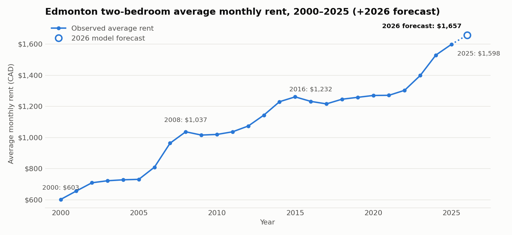
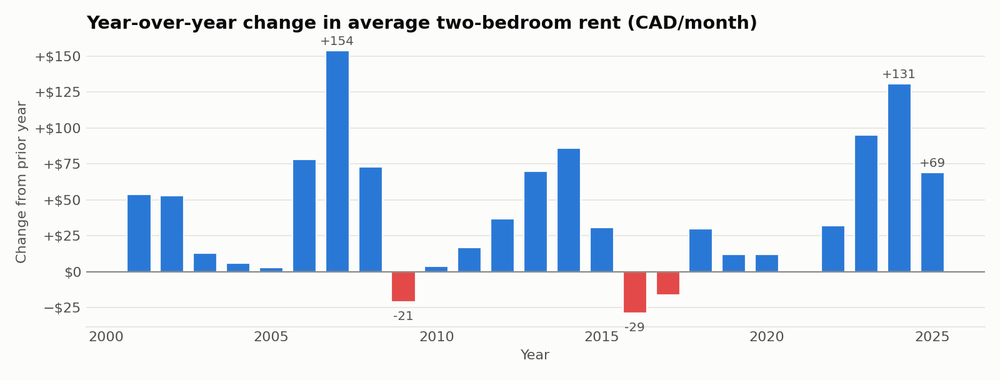
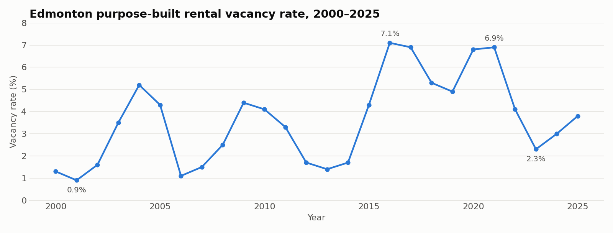
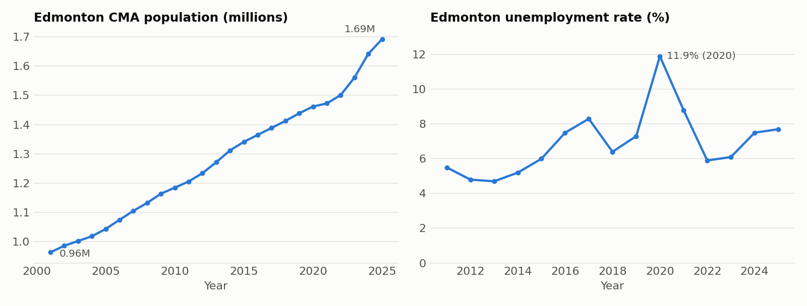
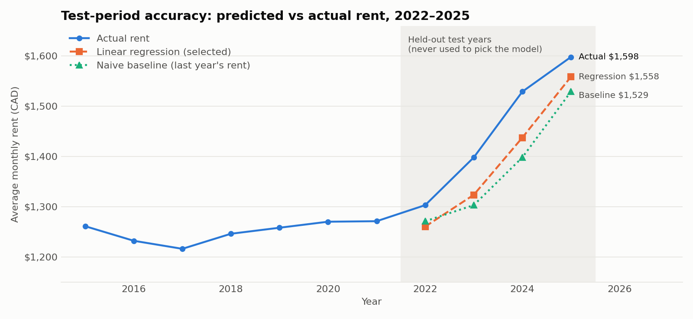
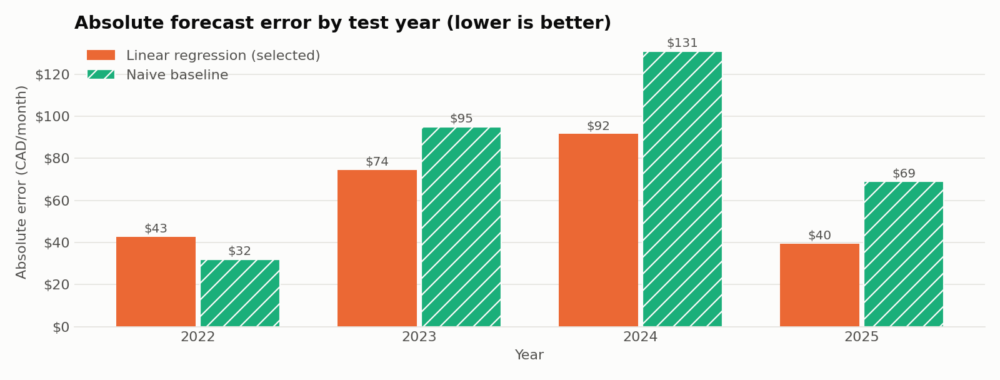
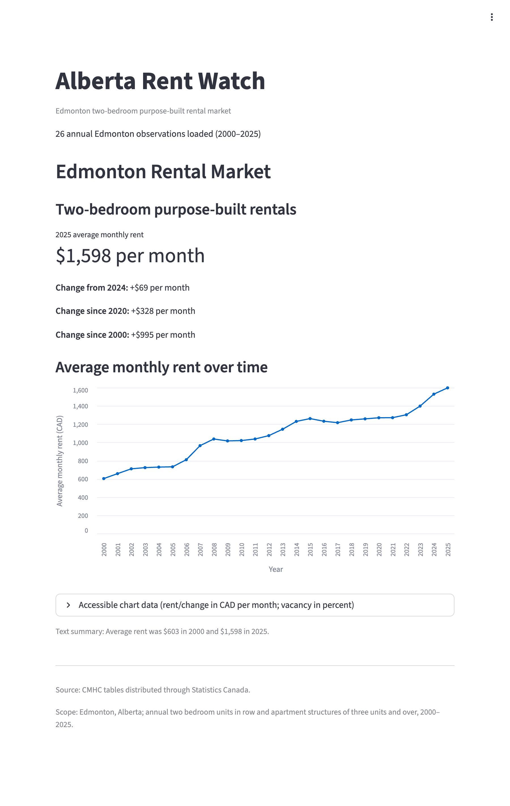

# Alberta Rent Watch

[](https://github.com/zsaghir/alberta-rent-watch/actions/workflows/ci.yml)

[](LICENSE)

A free, open-source project that uses public data to analyze and forecast rental-market conditions in Alberta.

The current version covers the **Edmonton census metropolitan area (CMA)**, **two-bedroom units in purpose-built rental buildings** (row and apartment structures with three or more units), with **annual data from 2000 to 2025**. Calgary is planned but not built yet.

The main research question is whether public rental, population, economic, and housing-construction data can predict future rental-market conditions.

---

## Summary

| | |
|---|---|
| Latest observed rent (2025) | **$1,598 / month** |
| Change from 2024 | **+$69** (+4.5%) |
| Change since 2020 | **+$328** |
| Change since 2000 | **+$995** (from $603, about 4.0% per year compounded) |
| Latest vacancy rate (2025) | **3.8%** |
| Forecasting model | Linear regression on last year's rent and last year's vacancy rate |
| Test-period accuracy (2022–2025) | **MAE $62.06 · RMSE $65.80 · R² 0.669** |
| Naive baseline on the same years | MAE $81.75 · RMSE $89.40 · R² 0.388 |
| **2026 forecast** | **$1,657.29 / month** (+$59, +3.7%) |



---

## Table of contents

1. [Project status](#project-status)
2. [Data collected](#data-collected)
3. [Pipeline and data flow](#pipeline-and-data-flow)
4. [Exploratory findings](#exploratory-findings)
5. [Forecasting model](#forecasting-model)
6. [Model accuracy](#model-accuracy)
7. [Streamlit dashboard](#streamlit-dashboard)
8. [Repository layout](#repository-layout)
9. [Dependencies](#dependencies)
10. [Setup and usage](#setup-and-usage)
11. [Tests and quality checks](#tests-and-quality-checks)
12. [Limitations](#limitations)
13. [Roadmap](#roadmap)
14. [Data sources and licence](#data-sources-and-licence)

---

## Project status

| Area | Status | Notes |
|---|---|---|
| Raw data collection (rent, vacancy, population, unemployment) | Done | Four Statistics Canada CSV exports in `data/raw/` |
| CMHC loader (wide CSV to tidy rows, with validation) | Done | `src/alberta_rent_watch/cmhc.py` |
| Canonical master dataset | Done | `data/processed/edmonton_2br_master.csv` (26 rows) |
| Dashboard JSON export with rent summary | Done | `data/website/edmonton_2br_history.json` |
| Streamlit dashboard (headline, comparisons, interactive chart, data table, source text) | Done | `app.py` |
| Model-ready dataset with lag features | Done | `data/model/edmonton_2br_model.csv` (25 rows) |
| Model training, selection, testing, and 2026 forecast | Done | `src/models/train_model.py` and `data/model/results/` |
| Notebooks | Done | Data checking, EDA, and forecasting notebooks all run from a fresh kernel with outputs saved |
| Automated tests | Done | 37 tests pass, and CI runs them with `ruff` on every push |
| Population and unemployment used as model features | Not started | Collected, but not joined to the master dataset yet |
| Forecast shown in the dashboard | Not started | Dashboard shows history only |
| Calgary coverage | Not started | Calgary vacancy data is already in the raw vacancy file |
| Static website | Planned | `website/` is reserved for a future static site |

### What was built, in commit order

| Commit | Milestone |
|---|---|
| `73d4ab1` | Set up the project with `uv` (package layout, Python 3.9) |
| `80eb4e0`, `a5c9247` | Downloaded and tested the raw CMHC rent and vacancy data |
| `fea4b70` | Switched from API/ZIP downloads to loading local CSVs. Removed `httpx`. Added parsing for Statistics Canada's wide, metadata-heavy CSV format |
| `5bb205f` | Loaded the dataset in a notebook |
| `bcbb784`, `05f682d` | Exported processed data to JSON for the dashboard |
| `462910a`, `e871a68`, `63a8e34` | Added Streamlit and built the dashboard page, which reads the JSON |
| `81cf042` | Added the resident summary (latest rent and dollar comparisons) |
| `7aae03a`, `0c82b01` | Added the rent chart with interactive tooltips and an accessible data table |
| `47caee2` | Built and validated the canonical master CSV |
| `f9c4e25` | Added lag variables for the model |
| `246e9a5` | Added the model training pipeline, saved results, and the forecasting notebook |

---

## Data collected

All data comes from **Statistics Canada** tables, downloaded as CSV into `data/raw/`. The rent and vacancy tables are **CMHC Rental Market Survey** data distributed through Statistics Canada.

| File | Table | What it contains | Coverage in file | Used in the model? |
|---|---|---|---|---|
| `cmhc_rent.csv` | [34-10-0133-01](https://www150.statcan.gc.ca/t1/tbl1/en/tv.action?pid=3410013301) | Average rent, Edmonton, two-bedroom units, by structure type (row and apartment, row only, apartment 3+, apartment 6+) | 2000–2025, released 2025-12-17 | Yes (row and apartment, 3+ units) |
| `cmhc_vacancy.csv` | [34-10-0130-01](https://www150.statcan.gc.ca/t1/tbl1/en/tv.action?pid=3410013001) | Vacancy rate for row and apartment structures with 3+ units, **all Canadian CMAs**, including Edmonton and Calgary | 1992–2025, released 2025-12-17 | Yes (Edmonton, 2000–2025) |
| `statcan_population.csv` | [17-10-0148-01](https://www150.statcan.gc.ca/t1/tbl1/en/tv.action?pid=1710014801) | Population estimates as of July 1, Edmonton CMA, 2021 boundaries | 2001–2025, released 2026-01-14 | Not yet |
| `statcan_unemployment.csv` | [14-10-0461-01](https://www150.statcan.gc.ca/t1/tbl1/en/tv.action?pid=1410046101) | Unemployment rate, Edmonton CMA, age 15+ | 2011–2025, released 2026-01-09 | Not yet |

### Canonical master dataset

`data/processed/edmonton_2br_master.csv` has 26 rows, one per year, with no missing values.

| Column | Type | Unit | Range |
|---|---|---|---|
| `year` | int | – | 2000 to 2025 |
| `average_rent` | float | CAD per month | $603 (2000) to $1,598 (2025) |
| `vacancy_rate` | float | percent | 0.9% (2001) to 7.1% (2016) |

<details>
<summary>Full master dataset (26 rows)</summary>

| Year | Avg rent (CAD) | Vacancy (%) | | Year | Avg rent (CAD) | Vacancy (%) |
|---|---|---|---|---|---|---|
| 2000 | 603 | 1.3 | | 2013 | 1,144 | 1.4 |
| 2001 | 657 | 0.9 | | 2014 | 1,230 | 1.7 |
| 2002 | 710 | 1.6 | | 2015 | 1,261 | 4.3 |
| 2003 | 723 | 3.5 | | 2016 | 1,232 | 7.1 |
| 2004 | 729 | 5.2 | | 2017 | 1,216 | 6.9 |
| 2005 | 732 | 4.3 | | 2018 | 1,246 | 5.3 |
| 2006 | 810 | 1.1 | | 2019 | 1,258 | 4.9 |
| 2007 | 964 | 1.5 | | 2020 | 1,270 | 6.8 |
| 2008 | 1,037 | 2.5 | | 2021 | 1,271 | 6.9 |
| 2009 | 1,016 | 4.4 | | 2022 | 1,303 | 4.1 |
| 2010 | 1,020 | 4.1 | | 2023 | 1,398 | 2.3 |
| 2011 | 1,037 | 3.3 | | 2024 | 1,529 | 3.0 |
| 2012 | 1,074 | 1.7 | | 2025 | 1,598 | 3.8 |

</details>

### Model-ready dataset

`data/model/edmonton_2br_model.csv` adds two **lag features**, which are the previous year's values:

- `rent_lag1`: last year's average rent
- `vacancy_lag1`: last year's vacancy rate

The first year (2000) has no previous year, so it is dropped. That leaves **25 rows (2001–2025)**. Using lagged inputs means each prediction only uses information that was available at the start of the year being predicted, so there is no look-ahead leakage.

---

## Pipeline and data flow

```text
 data/raw/cmhc_rent.csv ─┐
                         ├─► alberta_rent_watch.cmhc.load_cmhc_data()   (parse wide StatCan CSV → tidy Polars frame, validate)
 data/raw/cmhc_vacancy.csv┘            │
                                       ├─► src/data/export_website.py ─► data/website/edmonton_2br_history.json ─► app.py (Streamlit)
                                       │        (metadata + rent_summary + 26 records)
                                       │
                                       └─► src/data/build_master.py ──► data/processed/edmonton_2br_master.csv
                                                                              │
                                              src/data/build_model_data.py ◄──┘   (add rent_lag1, vacancy_lag1)
                                                                              │
                                                  data/model/edmonton_2br_model.csv
                                                                              │
                                              src/models/train_model.py ◄─────┘   (baseline vs linear regression, test, refit, forecast)
                                                                              │
                          data/model/results/model_summary.json + test_predictions.csv ─► notebooks/03_forecasting.ipynb
```

### 1. Loading (`src/alberta_rent_watch/cmhc.py`)

Statistics Canada CSV exports are "wide": the file starts with title and metadata lines, then has one row per series with one column per year, followed by footnotes. The loader:

- reads each file with `utf-8-sig` so the byte-order mark is removed
- checks the file contains the expected table ID (`34-10-0133-01` or `34-10-0130-01`), which catches files that were swapped by mistake
- finds the `Geography`, `Type of unit`, and `Type of structure` rows and checks that the rent file is filtered to **Edmonton, Alberta** and **Two bedroom units**
- selects the **"Row and apartment structures of three units and over"** series
- keeps only the year columns from 2000 to 2025 and rejects duplicate year columns
- parses numbers with thousands separators (`"1,037"`) and treats Statistics Canada's missing-value symbol `..` as null
- requires the rent and vacancy files to cover exactly the same years
- returns a tidy Polars DataFrame with the columns `year`, `city`, `average_rent`, and `vacancy_rate`

### 2. Master dataset (`src/data/build_master.py`)

This step takes the columns `year`, `average_rent`, and `vacancy_rate`, casts their types, sorts by year, and runs `validate_master()`. The validation checks that:

- the columns are exactly as expected
- there are exactly 26 rows with unique, consecutive years from 2000 to 2025
- there are no missing rent or vacancy values
- rent is greater than 0 and vacancy is between 0 and 100

### 3. Dashboard export (`src/alberta_rent_watch/export.py`, `summary.py`)

This step writes `data/website/edmonton_2br_history.json`, which contains:

- `metadata`: source, table IDs, geography, unit and structure type, year range, units, and the date the file was generated
- `rent_summary`: the latest year, the latest rent, and the dollar change from the prior year, from 2020, and from 2000. If a comparison year is missing, the code raises an error instead of reporting a wrong value
- `records`: the 26 annual observations

### 4. Feature engineering (`src/data/build_model_data.py`)

`add_lag_features()` checks that the master years are unique and consecutive, adds `rent_lag1` and `vacancy_lag1` with `shift(1)`, and drops the first row. `build_model_data()` reads the master CSV and writes the model CSV. A test confirms that rebuilding produces the committed file byte for byte.

### 5. Training and forecasting (`src/models/train_model.py`)

See [Forecasting model](#forecasting-model).

---

## Exploratory findings

### Rent has risen steadily, in three bursts



- **2006–2008 boom:** rent rose **$78, $154, and $73** in three consecutive years. The +19% in 2007 is the largest one-year increase in the series.
- **Two periods of decline:** 2009 (−$21, after the financial crisis) and 2016–2017 (−$29 and −$16, after the oil-price crash).
- **2020–2021 flat period:** rent rose only $12 and then $1.
- **2023–2025 surge:** **+$95, +$131, and +$69**, which added $295 in three years. That is more than the total increase over the previous nine years (2014–2022).

### Vacancy moves opposite to rent growth



Vacancy ranged from **0.9% (2001)** to **7.1% (2016)**. It peaked during soft periods (2004, 2009, 2016–2017, 2020–2021) and fell sharply before rent surges (1.1% in 2006, 1.4% in 2013, 2.3% in 2023). The correlation between **last year's vacancy rate** and **this year's percentage rent change** is **−0.56**. This relationship is why lagged vacancy is included as a model feature.

### Context data collected but not modelled yet



- **Population** grew from 0.96M (2001) to **1.69M (2025)**. Growth sped up after 2022, adding about 50K to 80K people per year from 2023 to 2025, which lines up with the latest rent surge.
- **Unemployment** peaked at **11.9% in 2020** and was 7.7% in 2025. This series only starts in 2011, so adding it would cut the model's training history by about ten years.

These two series are the obvious next features to try (see [Roadmap](#roadmap)).

---

## Forecasting model

### Problem setup

- **Target:** `average_rent` in year *t*
- **Features:** `rent_lag1` (rent in year *t−1*) and `vacancy_lag1` (vacancy in year *t−1*)
- **Candidates:**
  1. **Naive baseline:** predict that this year's rent equals last year's rent. It has no parameters and is the standard benchmark for time series.
  2. **Linear regression** (`scikit-learn` `LinearRegression`) on both lag features.

### Chronological split

The data is split by year, never randomly, so the model is never trained on future years.

| Split | Years | Rows | Purpose |
|---|---|---|---|
| Training | 2001–2018 | 18 | Fit candidate models |
| Validation | 2019–2021 | 3 | Choose between the baseline and regression |
| Test | 2022–2025 | 4 | Final, unbiased accuracy check. Not used for model selection |

### Procedure

1. Fit the regression on the **training** years and compare its validation MAE with the baseline's. The model with the lower MAE is selected.
2. Refit the selected model on **training + validation** (2001–2021) and score it once on the **test** years (2022–2025).
3. Refit a **production** model on **all 25 rows** and predict **2026** from the 2025 values (rent $1,598, vacancy 3.8%).
4. Save `model_summary.json` and `test_predictions.csv` to `data/model/results/`.

`validate_model_data()` checks the input before training. It rejects missing or non-numeric columns, missing or non-finite values, duplicate or out-of-order years, and any split that would be empty.

### Model selection result

| Model | Validation MAE (2019–2021) |
|---|---|
| Naive baseline | $8.33 |
| **Linear regression** | **$8.18** (selected) |

The two models are very close on validation. Rent barely moved from 2019 to 2021, so both predicted those years almost perfectly. The test years separate them much more clearly.

### Production model

```text
predicted_rent(t) = 46.2515 + 1.0412 × rent(t−1) − 13.8905 × vacancy(t−1)
```

- **rent_lag1 = 1.0412:** if last year's vacancy is held constant, each $1 of last year's rent adds about $1.04 to this year's prediction. This captures the long-term upward trend of roughly 4% a year.
- **vacancy_lag1 = −13.89:** if last year's rent is held constant, each additional percentage point of vacancy last year lowers this year's predicted rent by about **$13.89**. More empty units mean less pressure on rents.
- **Intercept = 46.25:** this is needed mathematically but does not have a realistic meaning, because rent and vacancy are never both zero.

The coefficients are stable across refits. Trained on 2001–2018 they are 0.981 and −11.90; on 2001–2021 they are 0.985 and −11.32; on all data they are 1.041 and −13.89.

### 2026 forecast

**$1,657.29 per month**, which is **+$59 (+3.7%)** compared with 2025. It is shown as the hollow point at the end of the chart at the top of this README.

---

## Model accuracy

The metrics below were produced by `train_model()` and reproduced by running `notebooks/03_forecasting.ipynb`.

| Metric (2022–2025 test years) | Linear regression (selected) | Naive baseline |
|---|---|---|
| **MAE** (average absolute error) | **$62.06** | $81.75 |
| **RMSE** (penalizes large misses more) | **$65.80** | $89.40 |
| **R²** (share of variation explained) | **0.669** | 0.388 |

Compared with the baseline, the regression reduces average error by about **24%**.





| Year | Actual | Regression prediction | Error | Baseline prediction | Error |
|---|---|---|---|---|---|
| 2022 | $1,303 | $1,260.30 | $42.70 | $1,271 | $32 |
| 2023 | $1,398 | $1,323.51 | $74.49 | $1,303 | $95 |
| 2024 | $1,529 | $1,437.43 | $91.57 | $1,398 | $131 |
| 2025 | $1,598 | $1,558.50 | $39.50 | $1,529 | $69 |

### What the accuracy results show

- The regression beats the baseline in **3 of 4** test years. It loses only in 2022, when vacancy was still high (6.9% in 2021) and the model expected rent to drop slightly.
- **Both models under-predicted every test year.** The 2023–2024 surge was faster than anything a two-feature, one-year-lag model can anticipate. The vacancy signal (vacancy fell from 6.9% to 2.3%) pushed the regression in the right direction, but not far enough.
- The error was largest in 2024 ($92) and fell back to $40 in 2025 once the surge was reflected in the lagged rent.
- With only **four test points**, R² and RMSE are noisy. Treat these numbers as a benchmark, not proof of forecasting skill.

---

## Streamlit dashboard



`app.py` is a small resident-facing dashboard. It only reads `data/website/edmonton_2br_history.json`. It never reads raw data or notebook output.

It shows:

- the title, scope ("Edmonton two-bedroom purpose-built rental market"), and how many observations were loaded (26, 2000–2025)
- a **headline metric**: "2025 average monthly rent: $1,598 per month"
- **dollar comparisons**: +$69 from 2024, +$328 since 2020, and +$995 since 2000
- an **interactive Vega-Lite line chart** of rent by year. Hovering shows the year, rent, change from the prior year, and vacancy rate. For 2000 the change is left empty rather than shown as $0
- an **accessible data table** (in an expander) with the same values, which can be navigated with the keyboard
- a **text summary** of the first and last values (dollar signs are escaped so Streamlit does not render the text between them as a LaTeX formula), plus **source and scope captions** generated from the JSON metadata
- a clear error message, with no crash, if the JSON is missing or malformed

```bash
uv run streamlit run app.py      # http://localhost:8501
```

---

## Repository layout

```text
alberta-rent-watch/
├── .github/workflows/ci.yml       CI: uv sync --locked, ruff, pytest
├── LICENSE                        MIT
├── app.py                         Streamlit dashboard (reads website JSON only)
├── pyproject.toml / uv.lock       Project metadata and locked dependencies (uv)
├── .python-version                3.9
├── data/
│   ├── raw/                       Unmodified Statistics Canada CSV exports (4 files)
│   ├── processed/                 edmonton_2br_master.csv — canonical 26-row dataset
│   ├── model/                     edmonton_2br_model.csv — 25 rows with lag features
│   │   └── results/               model_summary.json, test_predictions.csv
│   └── website/                   edmonton_2br_history.json — dashboard payload
├── src/
│   ├── alberta_rent_watch/        Installable package
│   │   ├── cmhc.py                StatCan wide-CSV loader + validation
│   │   ├── summary.py             Latest-rent and dollar-change summary
│   │   └── export.py              Dashboard JSON export
│   ├── data/
│   │   ├── build_master.py        Build + validate the master CSV
│   │   ├── build_model_data.py    Add lag features
│   │   └── export_website.py      Write the dashboard JSON
│   └── models/
│       └── train_model.py         Baseline vs regression, test, refit, forecast
├── notebooks/
│   ├── 01_data_checking.ipynb     Loads raw data, checks completeness, plots rent
│   ├── 02_eda.ipynb               Rent growth, vacancy, correlation, context series
│   └── 03_forecasting.ipynb       Inspects model results and coefficients
├── scripts/
│   └── make_readme_charts.py      Regenerates the charts in docs/images/
├── docs/images/                   README figures and dashboard screenshot
├── tests/                         pytest suite (37 tests)
└── website/                       Reserved for a future static site
```

---

## Dependencies

The project is managed with **[uv](https://docs.astral.sh/uv/)** and built with the `uv_build` backend. It requires **Python ≥ 3.9**, and `.python-version` pins 3.9. Exact resolved versions are recorded in `uv.lock`.

### Runtime

| Package | Constraint | Installed | Used for |
|---|---|---|---|
| `polars` | ≥ 1.36.1 | 1.36.1 | Loading, cleaning, validating, and exporting the rent and vacancy data |
| `pandas` | ≥ 2.3.3 | 2.3.3 | Feature engineering and model data handling |
| `numpy` | ≥ 2.0.2 | 2.0.2 | Numeric checks and RMSE |
| `scikit-learn` | ≥ 1.6.1 | 1.6.1 | `LinearRegression`, MAE, MSE, and R² |
| `matplotlib` | ≥ 3.7.0 | 3.9.4 | Notebook plots and README charts |
| `streamlit` | ≥ 1.50.0 | 1.50.0 | Dashboard, including its built-in Vega-Lite charts |

### Development (`[dependency-groups] dev`)

| Package | Constraint | Installed | Used for |
|---|---|---|---|
| `pytest` | ≥ 8.4.2 | 8.4.2 | Test suite, including Streamlit's `AppTest` for the dashboard |
| `ruff` | ≥ 0.16.3 | 0.16.3 | Linting, including notebooks |
| `ipykernel` | ≥ 6.31.0 | 6.31.0 | Running notebooks against the project `.venv` |

The standard library modules `csv`, `json`, `pathlib`, and `datetime` handle raw CSV parsing and JSON output. `httpx` was used in an early version to download data and was removed when the project switched to local CSV files.

---

## Setup and usage

```bash
# 1. Install uv (https://docs.astral.sh/uv/) and sync the environment
uv sync                                   # creates .venv with runtime + dev deps

# 2. Rebuild the data pipeline (run from the repository root)
uv run python src/data/build_master.py     # → data/processed/edmonton_2br_master.csv
uv run python src/data/build_model_data.py # → data/model/edmonton_2br_model.csv
uv run python src/data/export_website.py   # → data/website/edmonton_2br_history.json

# 3. Train, evaluate, and forecast
uv run python src/models/train_model.py
#   Selected model: linear_regression
#   Test metrics: MAE=62.06, RMSE=65.80, R²=0.669
#   2026 forecast: $1,657.29

# 4. Launch the dashboard
uv run streamlit run app.py

# 5. Regenerate the README charts
uv run python scripts/make_readme_charts.py
```

All scripts build their paths from the project root, so they can be run from any directory.

To update the data, download new CSVs from the Statistics Canada tables listed above, filter them to the same geography, unit, and structure, replace the files in `data/raw/`, and adjust `LAST_YEAR` in `cmhc.py` and `build_master.py`.

---

## Tests and quality checks

```bash
uv run pytest -q          # 37 passed
uv run ruff check .       # All checks passed (includes notebooks)
```

| Test file | What it covers |
|---|---|
| `test_cmhc.py` | Converting wide CSVs to tidy rows, `1,398` and `..` values, wrong table ID, wrong city, duplicate years, mismatched years |
| `test_build_master.py` | Exact schema, 26 rows, first and last rows, CSV round-trip, rejection of missing, zero, and out-of-range values |
| `test_summary.py` | Exact values for the 2025 summary; an error is raised if the 2020 comparison year is missing |
| `test_export.py` | 26 unique ordered records, fixed field set, boundary values, metadata units |
| `test_build_model_data.py` | Lag values in chronological order, missing columns, duplicate or missing years, rebuilding the committed model CSV byte for byte |
| `test_app.py` | The dashboard runs with no exception or error, shows the $1,598 headline, and renders the text summary with escaped dollar signs |
| `test_train_model.py` | Importing the module has no side effects; results are finite and complete; model selection works on synthetic data where the regression should win and where the baseline should win; input validation; saved JSON and CSV contracts; null coefficients for the baseline |

**Continuous integration:** `.github/workflows/ci.yml` runs on every push to `main` and on every pull request. It installs uv, runs `uv sync --locked` (which fails if `uv.lock` is out of date), then `ruff check .` and `pytest`.

**Verification (2026-09-24):**

- `uv run pytest -q`: 37 passed.
- `uv run ruff check .`: all checks passed.
- The CI steps also pass on a fresh clone.
- Rebuilding the master and model CSVs and rerunning `train_model()` reproduces the committed data and results byte for byte.
- All three notebooks run from a fresh kernel without errors, and their saved outputs match the numbers in this README.

---

## Limitations

- **Small sample.** There are 25 annual observations and only 4 test years. The metrics are indicative, not statistically robust.
- **Associations, not causes.** The coefficients describe historical co-movement between vacancy and rent. They do not show that vacancy changes cause rent changes.
- **Narrow scope.** The model covers one city, one unit type (two-bedroom), and purpose-built rentals only. Condo rentals and secondary suites are not included.
- **Surveyed averages.** CMHC rents are October survey averages across *occupied* units. They move more slowly than asking rents for newly listed units.
- **Boundary changes.** CMHC notes that geographies are redefined every five years, so the series is "not strictly comparable historically."
- **Systematic under-prediction in fast markets.** A one-year-lag linear model reacts late to sudden shifts in demand, such as the 2023–2024 surge.
- **No uncertainty range.** The 2026 forecast is a single number with no prediction interval.

## Roadmap

- Join **population** and **unemployment** into the master dataset and test whether they improve accuracy compared with the current model
- Add prediction intervals and walk-forward (rolling-origin) validation
- Show the 2026 forecast and model accuracy in the Streamlit dashboard
- Extend to **Calgary**. Vacancy data is already collected, and rent needs a matching export
- Add housing-construction data such as starts, completions, and permits. Later, test whether LLM-derived features from permit descriptions improve forecasts
- Add a single command that runs the whole pipeline, and build the static site in `website/`

## Data sources and licence

The code is released under the [MIT License](LICENSE).


- Statistics Canada. Table 34-10-0133-01, *Canada Mortgage and Housing Corporation, average rents for areas with a population of 10,000 and over*.
- Statistics Canada. Table 34-10-0130-01, *Canada Mortgage and Housing Corporation, vacancy rates, row and apartment structures of three units and over, privately initiated in census metropolitan areas*.
- Statistics Canada. Table 17-10-0148-01, *Population estimates, July 1, by census metropolitan area and census agglomeration, 2021 boundaries*.
- Statistics Canada. Table 14-10-0461-01, *Labour force characteristics by census metropolitan area, annual*.

The CMHC data is provided under the [CMHC Licence Agreement for the Use of Data](https://www.cmhc-schl.gc.ca/about-us/terms-conditions/hmip-terms-conditions). Statistics Canada data is used under the [Statistics Canada Open Licence](https://www.statcan.gc.ca/en/reference/licence).
